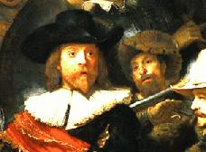
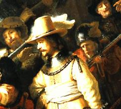
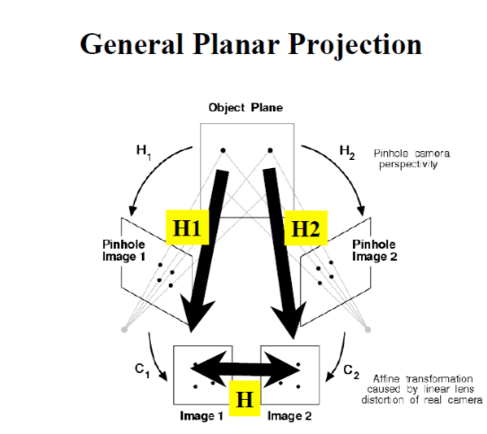
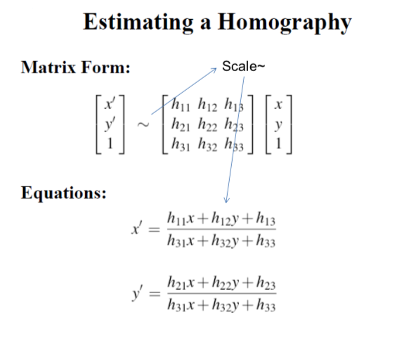
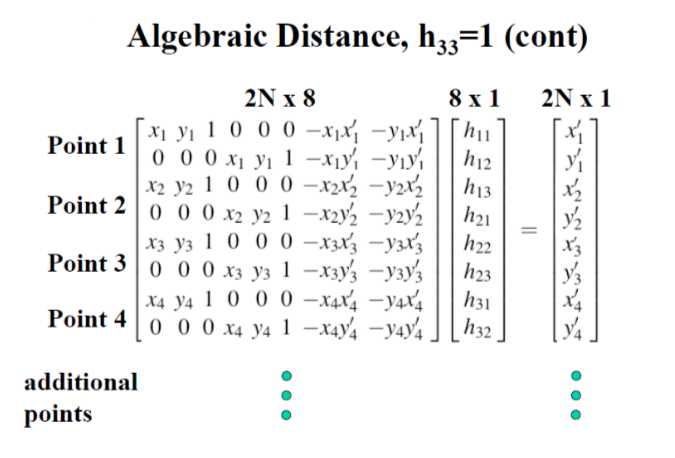
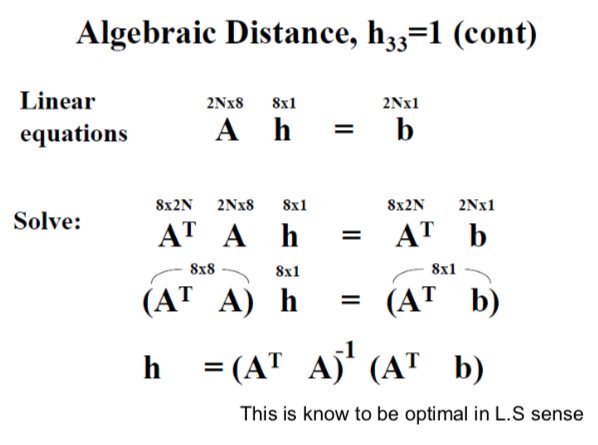
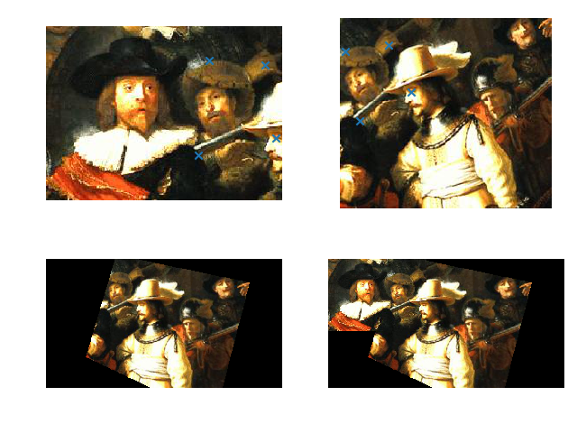

# Image-Warping-Stitching

---

## Feature

- Image warping with making homography matirx
- And then, stitching image by using OpenCV

---

## Requirements

- Please Reference requirements.txt

  ```$ pip install opencv-python```
  ```$ pip install matplotlib```
  ```$ pip install scikit-image```


---

## Source Image

**nachtwacht1.jpg**



**nachtwacht2.jpg**



---

## Get homography matrix







```python
# Setting matching points in first image
xy_1 = np.array([[157, 32],  # x1[0][0], y1[0][1]
                 [211, 37],  # x2[1][0], y2[1][1]
                 [222, 107],  # x3[2][0], y3[2][1]
                 [147, 124]])  # x4[3][0], y4[3][1]

# Setting matching points in second image
xy_2 = np.array([[6, 38],  # x'1[0][0], y'1[0][1]
                 [56, 31],  # x'2[1][0], y'2[1][1]
                 [82, 85],  # x'3[2][0], y'3[2][1]
                 [22, 118]])  # x'4[3][0], y'4[3][1]
```


**Get homography matrix with cv2 module**

```python
cv2_Homography = cv2.getPerspectiveTransform(xy_1.astype(np.float32), xy_2.astype(np.float32))
```

**Make It**

```python
arrayA = np.array([[xy_1[0][0], xy_1[0][1], 1, 0, 0, 0, -xy_1[0][0] * xy_2[0][0], -xy_1[0][1] * xy_2[0][0]],
                   [0, 0, 0, xy_1[0][0], xy_1[0][1], 1, -xy_1[0][0] * xy_2[0][1], -xy_1[0][1] * xy_2[0][1]],
                   [xy_1[1][0], xy_1[1][1], 1, 0, 0, 0, -xy_1[1][0] * xy_2[1][0], -xy_1[1][1] * xy_2[1][0]],
                   [0, 0, 0, xy_1[1][0], xy_1[1][1], 1, -xy_1[1][0] * xy_2[1][1], -xy_1[1][1] * xy_2[1][1]],
                   [xy_1[2][0], xy_1[2][1], 1, 0, 0, 0, -xy_1[2][0] * xy_2[2][0], -xy_1[2][1] * xy_2[2][0]],
                   [0, 0, 0, xy_1[2][0], xy_1[2][1], 1, -xy_1[2][0] * xy_2[2][1], -xy_1[2][1] * xy_2[2][1]],
                   [xy_1[3][0], xy_1[3][1], 1, 0, 0, 0, -xy_1[3][0] * xy_2[3][0], -xy_1[3][1] * xy_2[3][0]],
                   [0, 0, 0, xy_1[3][0], xy_1[3][1], 1, -xy_1[3][0] * xy_2[3][1], -xy_1[3][1] * xy_2[3][1]]])
```

---

## Warping



**Warping(Homographic transformation with cv2 module)**

```python
cv2_warped = warp(f2, cv2_Homography, output_shape=(300, 550))
```

**Make warping source**

```python
# Make blank image
warped = np.zeros((300, 550, 3), np.float32)

# Make warping source
for y in range(0, 300):
    for x in range(0, 550):
        pixel = np.array([[x],
                          [y],
                          [1]])

        # Resource_pixel = np.asarray(np.asmatrix(inv_my_homo) * np.asmatrix(pixel))
        Resource_pixel = np.asarray(np.asmatrix(My_Homography_arr) * np.asmatrix(pixel))

        # Coordinate scale
        trans_x = Resource_pixel[0][0] / Resource_pixel[2][0]
        trans_y = Resource_pixel[1][0] / Resource_pixel[2][0]

        # Continue that pixels not matched
        if (trans_x < 0 or trans_y < 0
                or trans_x > f2.shape[1] - 1 or trans_y > f2.shape[0] - 1):
            continue

        # divided by two parts with integer & decimal number
        tx = int(trans_x)
        ty = int(trans_y)
        a = trans_x - tx
        b = trans_y - ty

        # Bilinear Interpolation
        warped[y][x] = ((((1.0 - a) * (1.0 - b)) * f2[ty][tx])
                        + ((a * (1.0 - b)) * f2[ty][tx + 1])
                        + ((a * b) * f2[ty + 1][tx + 1])
                        + (((1.0 - a) * b) * f2[ty + 1][tx]))
```

---

## Stitching

```python
# Image stitch
M, N = f1.shape[:2]
f_stitched = np.copy(warped)
f_stitched[0:M, 0:N, :] = f1
```

---

## Result



---
## Reference
Some Slides are from Prof. Robert Collins, Penn State Univ.

  **Environment & Tool**

   - Python 3.6
   - MacOS tesseract 4.0 beta
   - IDE : JetBrains PyCharm